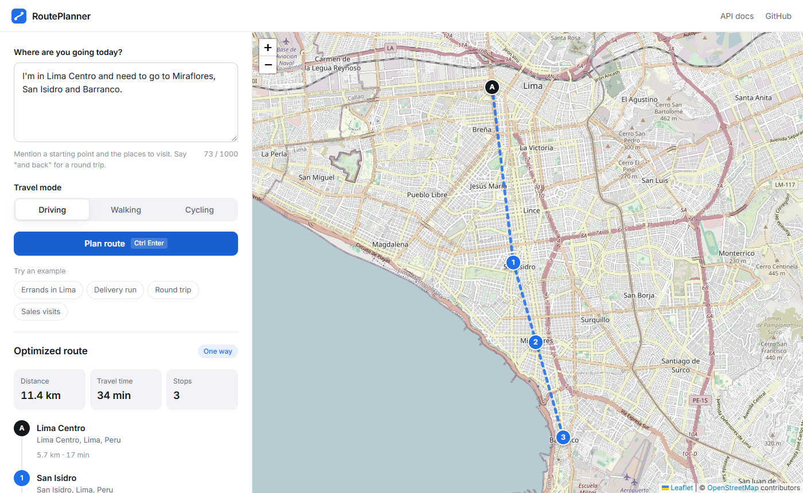
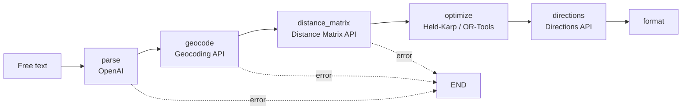

# RoutePlanner AI

[](https://github.com/LeonAchata/RoutePlanner-AI/actions/workflows/tests.yml)


Type the places you need to visit the way you would text a friend, and get back the fastest order to visit them, drawn on a map and ready to open in Google Maps.

```
Leaving from Av. Arequipa 1200, Lince. Deliveries at Av. Larco 789 Miraflores,
Jr. Sucre 456 Magdalena del Mar and Calle Los Olivos 123 Barranco.
```



I built this for a very ordinary problem: a delivery driver or a salesperson with five stops in Lima does not want to fill in a form, they want to paste a message and go. The interesting part is everything in between. The text has to be turned into a clean list of places, the places into coordinates, the coordinates into real travel times, and the travel times into an order that is actually optimal, not just "nearest first".

## How it works

The backend is a small [LangGraph](https://github.com/langchain-ai/langgraph) pipeline. Each node does one job and hands a typed state to the next. If any step fails (an address that does not exist, an island with no road to it, an API quota) the graph stops right there and the API returns a specific message instead of a generic 500.



1. **parse**. An OpenAI model (gpt-4o-mini by default) extracts the origin, the destinations and whether the person wants to come back. The output is validated with Pydantic, duplicates are dropped and the origin is never repeated as a destination. Spanish and English both work.
2. **geocode**. Every place is geocoded in parallel, biased towards the configured country so that "Miraflores" means the one in Lima. Results are cached in memory since the same addresses come up again and again. Two names that resolve to the exact same point are reported instead of silently producing a zero length leg.
3. **distance_matrix**. Builds the full N x N matrix of travel times and distances for the chosen mode (driving, walking or cycling). Large matrices are split into several requests to stay under Google's 100 elements per call limit.
4. **optimize**. Picks the visiting order that minimises total travel time. The matrix is directed (A to B is not the same as B to A when there are one way streets), and the solver respects that.
   - Up to 12 stops it uses the Held-Karp dynamic programming algorithm, which returns the proven optimum in a few milliseconds.
   - Beyond that it hands the problem to Google OR-Tools with guided local search and a two second budget, with nearest neighbour plus 2-opt as a fallback.
   - One way trips are solved as an open path, so the solver never pays for a return leg you are not going to drive.
5. **directions**. One Directions API call for the whole route returns the real per-leg times and the road polyline drawn on the map. If it fails the route is still returned using the matrix values.
6. **format**. Totals, and a Google Maps link built from coordinates rather than names, so the link opens exactly the places that were planned.

The frontend is plain HTML, CSS and JavaScript with Leaflet and OpenStreetMap tiles. It is served by the same FastAPI app, so there is nothing extra to build or deploy.

## Running it locally

You need Python 3.10 or newer, an OpenAI API key and a Google Maps Platform key with the **Geocoding**, **Distance Matrix** and **Directions** APIs enabled.

```bash
git clone https://github.com/LeonAchata/RoutePlanner-AI.git
cd RoutePlanner-AI

python -m venv .venv
source .venv/bin/activate        # on Windows: .venv\Scripts\activate
pip install -r requirements.txt

cp .env.example .env             # then put your keys in .env
uvicorn app.main:app --reload
```

Open http://localhost:8000 for the app and http://localhost:8000/docs for the interactive API reference.

### With Docker

```bash
docker build -t routeplanner .
docker run --rm -p 8000:8000 --env-file .env routeplanner
```

The container listens on `$PORT` (8000 by default), runs as a non-root user and has a health check on `/health`, so it can be deployed as is on Railway, Render, Fly.io or Cloud Run.

## Configuration

All settings are read from environment variables or a `.env` file.

| Variable | Default | Notes |
|---|---|---|
| `OPENAI_API_KEY` | | Required |
| `GOOGLE_MAPS_API_KEY` | | Required |
| `LLM_MODEL` | `gpt-4o-mini` | Any chat model that supports JSON mode |
| `LLM_TEMPERATURE` | `0.0` | |
| `GEOCODING_LANGUAGE` | `es` | Language of the addresses returned by Google |
| `DEFAULT_COUNTRY` | `PE` | Country code used to bias geocoding results |
| `MAX_STOPS` | `25` | Maximum stops per route, origin included. 25 is also the upper limit |
| `CORS_ORIGINS` | `*` | Comma separated list. Set it to your domain in production |
| `DEBUG` | `false` | Enables debug logging |

If a key is missing the server still starts. `/health` reports which variables are missing and `/api/route` answers with a 503 that says so, which is easier to debug than a crash on boot.

## API

### `POST /api/route`

```json
{
  "query": "From Lima Centro go to Barranco, San Isidro and Miraflores, then come back",
  "travel_mode": "driving"
}
```

`travel_mode` is optional and can be `driving`, `walking` or `bicycling`.

Response (shortened):

```json
{
  "origin": "Lima Centro",
  "optimized_order": ["Lima Centro", "San Isidro", "Miraflores", "Barranco", "Lima Centro"],
  "stops": [
    { "name": "Lima Centro", "address": "Cercado de Lima 15001, Peru", "lat": -12.0464, "lng": -77.0428 }
  ],
  "return_to_origin": true,
  "travel_mode": "driving",
  "total_distance_km": 24.8,
  "estimated_time_min": 71,
  "steps": [
    { "from": "Lima Centro", "to": "San Isidro", "distance": "6.1 km", "time": "17 min", "distance_km": 6.1, "duration_min": 17 }
  ],
  "route_polyline": "zr~gA~cwuM...",
  "google_maps_url": "https://www.google.com/maps/dir/?api=1&origin=..."
}
```

Errors always come back as `{"detail": "..."}` with a meaningful status:

| Status | When |
|---|---|
| 422 | The text could not be turned into a route: no destinations, an address Google cannot find, no road between two stops, too many stops |
| 502 | OpenAI or Google Maps failed or rejected the key |
| 503 | The server is missing an API key |

### `GET /health`

Returns the version and any missing configuration. Used by the Docker health check.

## Tests

```bash
pip install -r requirements-dev.txt
pytest
```

The suite runs without any API keys. OpenAI and Google Maps are replaced by small fakes, so the tests cover the whole pipeline through the HTTP layer: optimal ordering, round trips, fallbacks when the Directions API fails, error propagation and input validation. The solver is checked against brute force on random asymmetric matrices to make sure Held-Karp really returns the optimum. GitHub Actions runs everything on each push.

## Project layout

```
app/
  main.py              FastAPI app, serves the API and the frontend
  config.py            Settings loaded from the environment
  errors.py            Errors that carry an HTTP status and a user facing message
  graph/
    workflow.py        LangGraph definition and early exit on errors
    nodes/             One file per pipeline step
  services/
    llm_service.py     OpenAI call and output validation
    google_maps.py     Geocoding, Distance Matrix and Directions client
    tsp_solver.py      Held-Karp, OR-Tools and 2-opt
  models/              Graph state and API schemas
frontend/              index.html, style.css, app.js
tests/
```

## Limitations

- Google Maps share links only accept 9 intermediate stops. Longer routes are shown in the app but no link is generated, because Google would silently drop the extra stops.
- Travel times are Google's average estimates without live traffic. The app does not plan for a departure time yet.
- The geocoding cache lives in process memory, so it is lost on restart and not shared between replicas.

## Ideas for later

- Departure time and time windows per stop (deliveries between 9 and 11, for example)
- Splitting stops across several drivers
- Dragging stops on the map to adjust the order by hand
- Exporting the route as a list for WhatsApp

## License

MIT. See [LICENSE](LICENSE).
